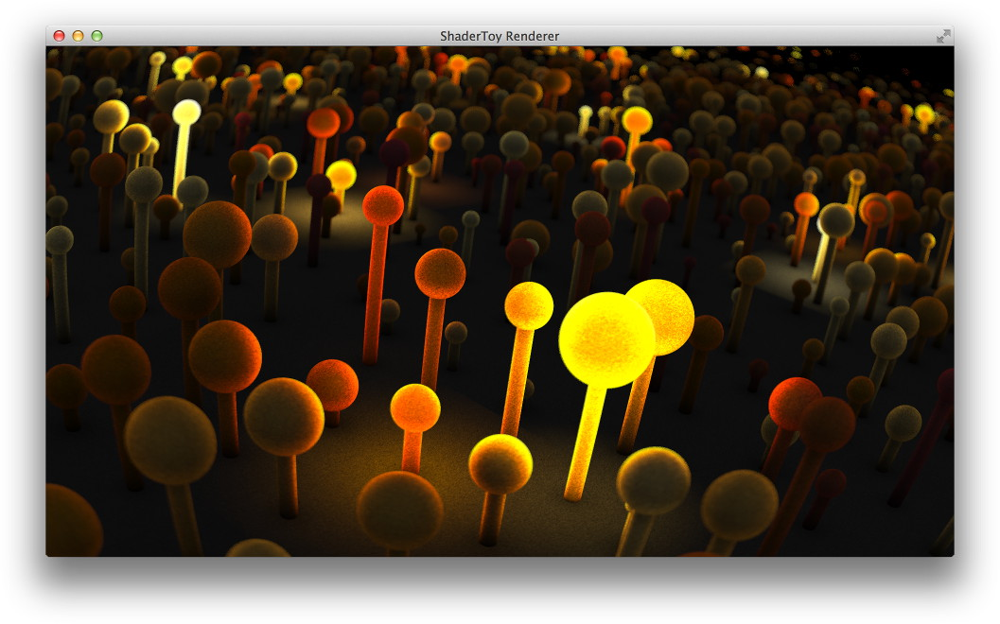

shadertoy-render
================

A simple Python script that uses `ffmpeg` to render ShaderToy scripts into video files.  Run it as follows:

	> python shadertoy-render.py example.glsl example.mp4

Dependencies include `numpy`, `scipy` and `vispy`.  You can install them with Python as follows:

    > pip install numpy scipy vispy

The output is a MP4 file with default encoding settings, which you can upload to YouTube for example.

1. `Source ShaderToy <https://www.shadertoy.com/view/4sB3D1>`_ script by Inigo Quilez.

2. `Rendered Video <https://youtu.be/GAauIQFHaZs>`_ at 1080p uploaded to YouTube.
